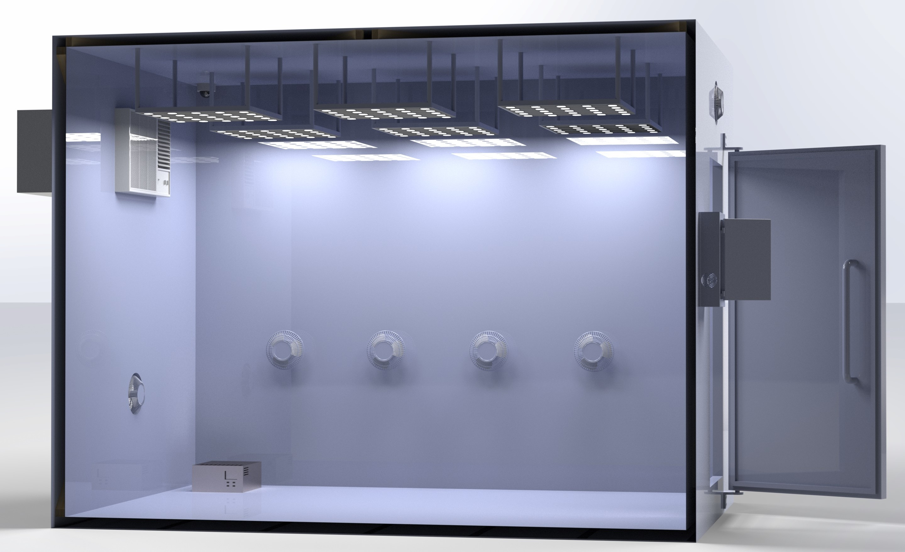

# ProgrammableIoTEnvironmentChamber
An environment chamber helps with space agriculture research.

## Project Statement
The objective is to provide an environmental chamber for agricultural research in space. The chamber allows the user to control the environmental conditions such as light, temperature, and humidity. This means that the user would be able to maximize the growth of plants by simulating the ideal conditions that would not be available in the surrounding environment. The user would also be able to simulate shorter growing seasons for their plants. This project is a solution that gives humans an opportunity to research growing sustainable crops in a controlled environment.

## Prepare for Developing
This section will guide you through the software and tools required for building this project.

### Software List
* Arduino IDE
* Node.js
* Node-Red
* SolidWorks
* SolidWorks Visualize
* Visual Studio Code

### Visual Studio Code
Visual Studio Code, also known as VSCode, is a popular and powerful text editor for developers. A good text editor is crucial for speeding up the coding process and debugging process.

#### Install Visual Studio Code
We recommend to use the official website for downloading the packages.
Please go to [https://code.visualstudio.com/](https://code.visualstudio.com/) and follow the instruction on the web page.

#### Recommended Extensions
We recommend you to install the listed extensions for boosting your coding experience with VSCode
* Arduino
* C/C++
* Python
* vscode-icons
* Code Spell Checker

## Photorealistic Renderings

## Major Modules

### Web UI
