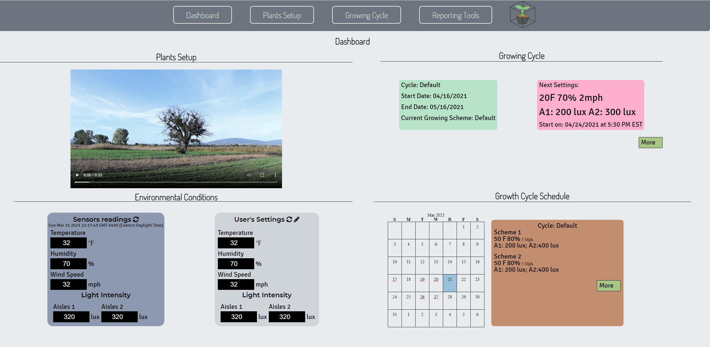

# ProgrammableIoTEnvironmentChamber
An environment chamber helps with space agriculture research. Project started in August 2020 and we are gradually pushing our progress to this repository.

## Project Overview
This section will guide you through the main progresses we have achieved.

### Photorealistic Rendering


### Website Dashboard and User Interface


### Lighting Control System
Since this part is very complicated and has plenty of contents, we have created a separated repository for it and treated it as a small project. Please check out [4ChannelBTA16TRIACControl](https://github.com/JiaweiHe98/4ChannelBTA16TRIACControl) for more information about the Lighting Control System!

### Automatic Sensor Data Acquisition System

## Project Statement
The objective is to provide an environmental chamber for agricultural research in space. The chamber allows the user to control the environmental conditions such as light, temperature, and humidity. This means that the user would be able to maximize the growth of plants by simulating the ideal conditions that would not be available in the surrounding environment. The user would also be able to simulate shorter growing seasons for their plants. This project is a solution that gives humans an opportunity to research growing sustainable crops in a controlled environment.

## Prepare for Developing
This section will guide you through the software and tools required for building this project.

### Software List
* Visual Studio Code
* Arduino IDE
* Python
* Node.js
* Node-Red
* SolidWorks
* SolidWorks Visualize

### Visual Studio Code
Visual Studio Code, also known as VSCode, is a popular and powerful text editor for developers. A good text editor is crucial for speeding up the coding process and debugging process.

#### Install Visual Studio Code
We recommend to use the official website for downloading the packages.
Please go to [https://code.visualstudio.com/](https://code.visualstudio.com/) and follow the instruction on the web page.

#### Recommended Extensions
We recommend you to install the listed extensions for boosting your coding experience with VSCode
* Arduino
* C/C++
* Python
* vscode-icons
* Code Spell Checker

### Arduino IDE
Arduino IDE is a open-source integrated development environment designated for all Arduino boards. We will use this software to compile our code and burn it to our Arduino. It also has a serial monitor which allows us to interact with Arduino through serial communication.

#### Install Arduino IDE
We also recommend to use the official website for downloading the packages if you are on a Windows or MacOS machine.
Simply go to [https://www.arduino.cc/en/software](https://www.arduino.cc/en/software) and find out your version.
If you want to use a Raspberry Pi or a Linux machine to program the Arduino, you can simply update your software list by ```sudo apt-get update``` and install Arduino IDE by ```sudo apt-get install arduino``` in your console.

### Python
Python is a widely used program language and both python2 and python3 interpreters are pre installed into Raspberry Pi OS and MacOS.

#### Install Python3 for Windows
Go to [https://www.python.org/downloads/](https://www.python.org/downloads/) and choose the version you prefer. Don't forget to add PATH for python interpreter.

#### Install pyserial package
pyserial can be installed through command line with pip. Type ```pip install pyserial``` to add pyserial library.

### Node.js
Go to [https://nodejs.org/en/download/](https://nodejs.org/en/download/) and download the designated version for you machine.

### Node-Red
Node-Red is a visual programming tool based on Node.js. It allows you to edit working flows inside a web browser through a wide range of nodes and deploy your flow by simply click deploy button on the right top corner.

#### Install Node-Red
If you are using Raspberry Pi and you chose "Raspberry Pi OS with desktop and recommended software", Node-red is already installed into your Raspberry Pi. Simply click the start button on the top-left and go to programming tab. Then, you will able to find Node-Red.

If you are using a Windows machine, you first need to install Node.js and nmp. Go to [https://nodejs.org/](https://nodejs.org/) and download for Windows. Run the MSI file as administrator. Accept the default settings while installing. When finishing the installation, type ```node --version; npm --version``` in Powershell or ```node --version && npm --version``` in cmd to make sure that your installation is completed.

You should see something similar to this:
```
v14.15.3
6.14.9
```

Then, install Node-Red through ```npm install -g --unsafe-perm node-red``` and add ```node-red``` to your system path.

If you are using Linux, you can install Node-Red with npm, docker, or snap. You can follow the [Documentation](https://nodered.org/docs/getting-started/local) on Node-Red official website.

### SolidWorks
SolidWorks is a software for Computer-Aided Design, Engineering, and Manufacturing developed by Dassault Systèmes, a French company. It was designed to run on Microsoft Windows so that it was not able to run on macOS. You need a licence to have SolidWorks running on your machine.

#### SolidWorks Visualize
SolidWorks Visualize is an add-on package to SolidWorks. It allow you to render photorealistic images with either Nvidia CUDA acceleration or OpenGL acceleration, which will truly boost you efficiency in rendering. The rendered pictures might be a little bit different when not using the same API, and all the renderings in this project are accelerated by Nvidia CUDA.

## Background Information

### Photosynthesis

### Control System Basics

### Computer Simulation: Finite Element Method

## Photorealistic Renderings


## Major Modules

### Web UI
